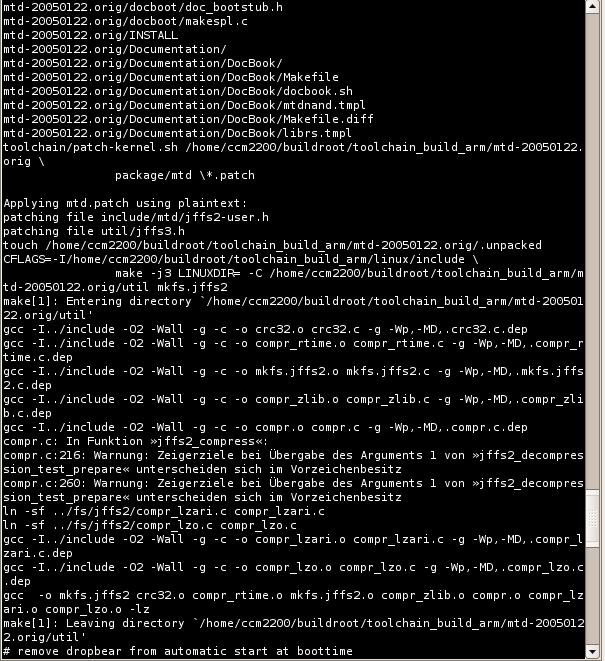
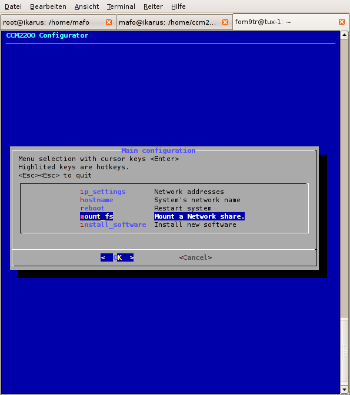
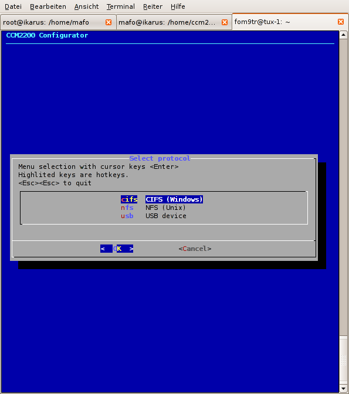
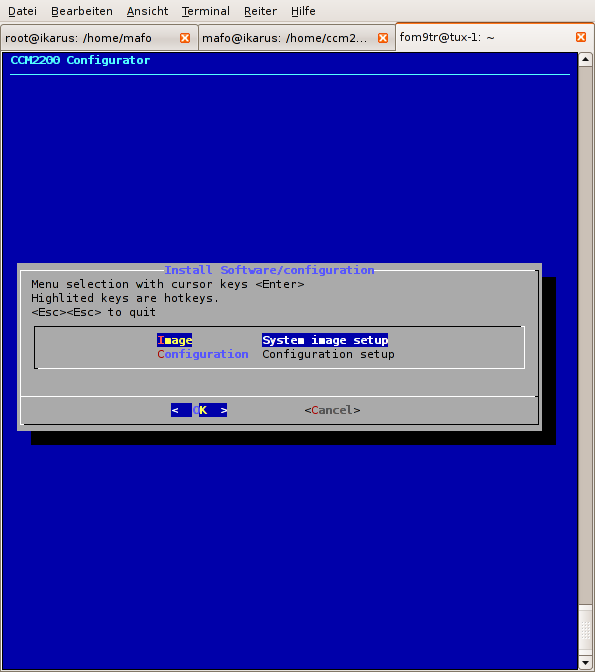
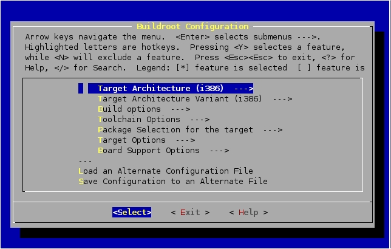
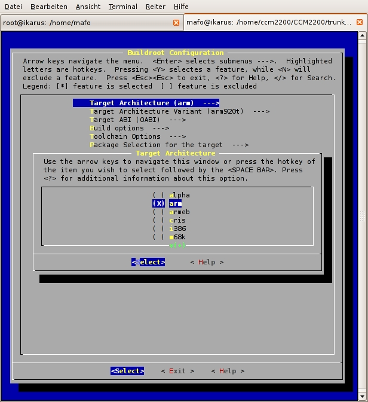
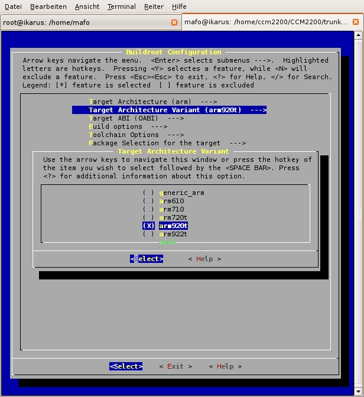
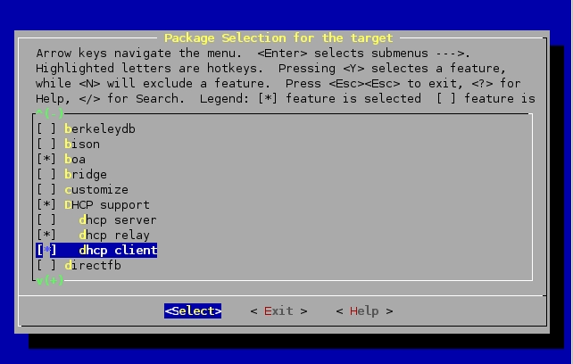

SWARCO Embedded Linux V2 operating system
=========================================

for CCM2200 Single Board Computer
by SWARCO Traffic Systems GmbH

| :warning: Warning <br> This documentation is based on old SWARCO-Linux documentation. It is **not** up to date in all points and primarly for orientation only. For new projects please use [SWARCO Linux V3](https://github.com/swarco/swarco-linux-v3) environment |
|--------------------|


|       | Table of contents                                   |
|-------|-----------------------------------------------------|
|     1 | Cross Compiler Toolchain                            |
|   1.1 | What is a Cross Compiler Toolchain                  |
|   1.2 | Programs and versions                               |
| 1.2.1 | gcc Compiler                                        |
| 1.2.2 | Buildroot                                           |
| 1.2.3 | uClibc                                              |
| 1.2.4 | binutils                                            |
|     2 | Installation and Configuration                      |
|   2.1 | Supported Host Systems                              |
| 2.1.1 | Debian-GNU Linux 3.1/Ubuntu Linux                   |
| 2.1.2 | SuSE-Linux &amp; openSUSE                           |
| 2.1.3 | Fedora Core                                         |
|   2.2 | Installation                                        |
|   2.3 | Build toolchain, userland, kernel and u-boot images |
|     3 | Update userland to CCM                              |
|   3.1 | Update via u-boot                                   |
|  3.1a | Update via ccm\_configurator script                 |
|   3.2 | Automatic update via USB memory key (Recovery mode) |
|     4 | Possible Connections                                |
|   4.1 | SSH Connection                                      |
|   4.2 | USB Device                                          |
|   4.3 | Bluetooth (optional)                                |
|     5 | Custom configuration of Buildroot                   |
|   5.1 | Target Architecture                                 |
|   5.2 | Target Architecture Variant                         |
|   5.3 | Build options                                       |
|   5.4 | Toolchain Options                                   |
|   5.5 | Package Selection for the target                    |
|   5.6 | Target Options                                      |
|   5.7 | Board Support Options                               |
|   5.8 | Compilation                                         |
|     6 | Creating code for ARM9                              |
|   6.1 | Cross compiler                                      |
|   6.2 | Using the cross compiler                            |
|     7 | Remote debugging on Target                          |
|   7.1 | Remote Debugger                                     |
|     8 | Installed Software                                  |
|   8.1 | BusyBox                                             |
|   8.2 | Bluez-Libs                                          |
|   8.3 | Bluez-Utils                                         |
|   8.4 | Iptables                                            |
|   8.5 | openSSL                                             |
|   8.6 | OpenSSH                                             |
|   8.7 | OpenVPN                                             |
|   8.8 | Lighttpd                                            |
|   8.9 | MTD                                                 |
|  8.10 | Nano                                                |
|  8.11 | Ncurses                                             |
|  8.12 | NTP                                                 |
|  8.13 | PPP                                                 |
|  8.14 | SQLite                                              |
|  8.15 | Dialog                                              |
|     9 | Optional Packages                                   |
|   9.1 | ProFTPD                                             |


# 1 Cross Compiler Toolchain

This chapter explains how to set up a Cross Compiler Toolchain under a standard Linux distribution (e.g. Debian/GNU-Linux, Ubuntu-Linux, etc.).

## 1.1 What is a Cross Compiler Toolchain

Because our target system has an ARM920 architecture and the host system on which we are developing has an i686 based architecture, we need an environment which allows us to cross compile the binaries to the target system architecture.

In this project we use the buildroot environment from [http://www.buildroot.org](http://www.buildroot.org/).

It provides a menu based environment, which can easily be used to set up a development environment for x86, PPC, MIPS, ARM, etc.

## 1.2 Programs and versions

The following programs and versions are used:

### 1.2.1 gcc Compiler

We use standard gcc compiler.

Version: gcc-4.2.3

URL: [ftp://ftp.gnu.org/gnu](ftp://ftp.gnu.org/gnu)

### 1.2.2 Buildroot

Buildroot is a set of Makefiles and patches which allows easily
generating both a cross-compilation toolchain and a root file system
for your target. The cross-compilation toolchain uses uClibc, a tiny C
standard library.

Buildroot is useful mainly for people working with embedded
systems. Embedded systems often use processors other than the usual
x86 processors. It can be PowerPC processors, MIPS processors, ARM
processors, etc.

A compilation toolchain is a set of tools that allows compiling the
code for your system. It consists of a compiler (in our case: gcc),
binary utilities like assembler and linker (in our case: binutils) and
a C standard library (for example GNU Libc, uClibc or dietlibc).

The system installed on your development station most likely already
has a compilation toolchain that you can use to compile applications
that run on your system. If you are using a PC, your compilation
toolchain runs on a x86 processor and generates code for a x86
processor.

Under most Linux systems, the compilation toolchain uses the GNU libc
as C standard library. This compilation toolchain is called the
&quot;host compilation toolchain&quot;, and more generally the machine
on which it is running and on which you are working is called the
&quot;host system&quot;.

This compilation toolchain is provided by your distribution and
Buildroot is not involved.

As said above, the compilation toolchain that comes with your system
runs on and generates code for the processor of your host
system. Since your embedded system has a different processor a
cross-compilation toolchain is needed: This is a compilation toolchain
that runs on your host system but generates code for your target
system (and target processor). For example, if your host system uses
x86 and your target system uses ARM, (as in our case) the regular
compilation toolchain of your host runs on x86 and generates code for
x86, whereas the cross-compilation toolchain runs on x86 and generates
code for ARM.

Even if your embedded system uses an x86 processor, Buildroot should
be considered for two reasons:

- The compilation toolchain of your host probably uses the GNU Libc,
  which is a complete but huge C standard library. Instead you could
  use uClibc which is a tiny C standard library. To do so, a
  compilation toolchain to generate binaries linked with it is
  necessary which Buildroot provides.
- Buildroot automates the building of a root file system with all
  necessary tools like busybox. Of course, gcc, binutils, uClibc and
  all the tools can be compiled manually, but this is rather
  time-consuming and uneffective. Buildroot automates this process
  through the use of Makefiles, and has a collection of patches for
  each gcc and binutils version to make them work on most
  architecture.

### 1.2.3 uClibc

Because of the constraints and limitations of embedded systems, the
size of the standard GNU C library restricts its use for our small
target. Instead, we rather need a C library that has sufficient
functionality while being relatively small.

Although it does not rely on the GNU C library, uClibc provides most
of the functionality needed. Although it is not as complete as the GNU
library and does not comply with all the standards with which the GNU
library complies, most applications that can be compiled against the
GNU C library will also compile and run using uClibc.

Version: uClibc-0.9.28

URL: [http://www.uClibc.org](http://www.uClibc.org/)

### 1.2.4 binutils

The binutils package includes the utilities most often used to
manipulate binary object files. The two most important utilities
within the package are the GNU assembler, &quot;as&quot;, and the
linker, &quot;ld&quot;.

Version: binutils-2.18

URL:

# 2 Installation and Configuration

## 2.1 Supported Host Systems

### 2.1.1 Debian / Ubuntu Linux

Debian GUN-Linux Version 3.1 (Sarge) to 8 (Jessie) is supported.

Ubuntu Linux 5.10 or newer is supported. Because Ubuntu is a desktop
system and not a developer system, after standard installation, you
have to perform the following steps:

    apt-get install cpp gcc g++ make

    apt-get install libc6-dev libncurses5-dev

    apt-get install gettext texinfo flex bison autoconf

    apt-get install liblzo2-dev liblzo2-2 libz-dev

### 2.1.2 SuSE-Linux &amp; openSUSE

SuSE-Linux and openSUSE are supported from version 10.1 and newer.

Because we need the gcc compiler and the binutils, the following
development packages must be installed additionally:

- C/C++ compiler and tools
- texinfo
- minicom

### 2.1.3 Fedora

Fedora is supported from version 17 and newer.

Install development packages:

    yum install autoconf automake binutils bison flex gcc gcc-c++

    yum install gdb gettext libtool texinfo make strace ncurses-devel

    yum install lzo-devel zlib-devel patch


## 2.2 Installation

Note:

To install your own buildroot environment in your home directory or wherever you want it, you should be logged in as ordinary user.

:warning: **Don't use the super user or root account for buildroot
compilation. This could accidentally overwrite important files in host
systems /usr and /etc directories in case of wrong path settings in
buildroots makefiles.**

Insert CD-ROM and mount it (if not already mounted by the used Desktop-Environment)

    $ mount /media/cdrom

Firstly, copy the contents from the SWARCO Traffic
SystemsEmbedded-Linux CD to a directory on your local hard-disk. Then
unpack your buildroot with the command:

    $ tar xvzf /media/cdrom/sources/userland/swarco-linux-20120326.tar.gz

    $ cd swarco-linux

Secondly, prepare build directory by copying all necessary files from
the cd-rom:

    ~/swarco-linux$ ./prepare\_tree.sh /media/cdrom/

Now you can continue building your own (preconfigured) embedded Linux simply by entering:

    $ make


## 2.3 Build toolchain, userland, kernel and u-boot images

    ~/swarco-linux$ make

**Note I:**

If you get the following error message, you are using a new version of
the glibc which definies a function getline in stdio.h which is
incompatible with a definition within older linux kernel sources.

 scripts/unifdef.c:209: error: conflicting types for &#39;getline&#39;

 /usr/include/stdio.h:651: note: previous declaration of &#39;getline&#39; was here

A possible workaround to get this error fixed is to edit the system
header file /usr/include/stdio.h and comment out the declaration of
the function &quot;getline&quot;. Please backup the original header
before making the change and restore it after the compilation of the
SWARCO Linux package has finished.

**Note II:**

Because on the first run the cross toolchain has to be compiled from
your host system, it will take some time, depending on the system
performance (e.g. approx. 30 minutes on a Centrino Dual Core 1.66GHz).

After the cross toolchain is built once every recompilation of the
userland will be much faster.

During the process the following messages from build process are
displayed on your screen:

 

Figure 1.1: Compilation Process

After the compilation process is finished, you should see the
directories build\_&lt;target\_arch&gt; as well as
toolchain\_build\_&lt;target\_arch&gt; in your buildroot directory.

The build\_&lt;target\_arch&gt; directory contains the compilation
directories for the single packages and the directory root which
contains the root file system of your new Embedded Linux.

# 3 Update userland to CCM2200

## 3.1 Update via u-boot

In order to run updates of the kernel &quot;root-fs or the
u-boot&quot;, a TFTP-Server on your Host-System must be installed.

To do so, put your images into the TFTP-Root directory. Plug a serial
cable to the console and open a console window of your favorite
terminal program (we use Kermit).

Then you can update the system by entering:

    # run update\_uboot\_tftp

    # run update\_kernel\_tftp

    # run update\_rootfs\_tftp\_nand

to the u-boot prompt.


**DEPRECATED (2011-01-12)**

## 3.2 Update via ccm\_configurator script

There are 3 different ways to update your root-fs via the ccm\_configurator script:

1. Install a NFS device (under Linux)
2. Install a CIFS device (Windows share or Linux samba share)
3. Install a USB device

where your new root-fs image is located.

Then choose your new rootfs-image from the installation dialog and confirm with **OK**.

The script will perform the update operation. If you are logged in via ssh, your current connection will be terminated but the update operation will continue.

After the update is finished, the system will reboot with the new system.

The following messages are displayed during the update process.

 

Figure 1: ccm2200\_configurator main menu

 

Figure 2: Protocol selection

 

Figure 3: Installer Dialog

## 3.3 Automatic update via USB memory key (Recovery mode)

One feature of the CCM2200 board is the automatic recovery installation of all on board flash memory from an USB memory key. Using this feature, you don&#39;t need a PC or another connection to the CCM. Thus, this method is particularly suitable for updates in field by service technician.

To start this update, prepare the USB memory key with the following files in root directory:

| ccm2200.bin | u-boot bootloader command file |
| --- | --- |
| rootfs-ccm2200-nand.jffs2 | NAND-flash image (Linux root filesystem) |
| uImage-ccm2200dev.bin | NOR-flash image (Linux kernel) |

Set DIP switch 5 on the CCM2200 board to the **ON** position. Then plug in the prepared USB-memory-key at the USB Host port on front panel from your CCM2200. Perform a hardware reset.

The update will take place immediately. At successfully completion the systemrestarts with the newly installed Linux kernel and rootfs. The boot process will be indicated by successive light up of CCM2200&#39;s front panel LEDs

If the update is successful, you can pull out the CCM2200 board and reset DIP switch 5 to **OFF** position again.

If an error occurs or the update process hangs you can reset the board and retry the update at any time. The u-boot bootloader itself will not be updated using this method. This ensures that aborted and erroneous updates can be retried without permanent corruption of CCM2200&#39;s memory.

:warning: **Not every low cost USB memory key on the marked is compatible with the u-boot bootloader. Thus it is not usable for the above described update procedure. To ensure successful updates, use only USB keys delivered by SWARCO Traffic Systems GmbH or other well known manufacturers. The operation of USB keys under Linux for mounting file systems is not affected by this restriction. The Linux driver includes many workarounds for USB mass storage devices which do not fully comply with the standard. The U-boot driver is a minimalist implementation that requires correct reaction of the USB memory device.**

# 4 Possible Connections

There are several possibilities to connect the service or development
PC to a CCM2200.

## 4.1 SSH Connection

It is possible, to connect to the CCM2200 via ssh. The standard
IP-Address of the CCM2200 is set to 192.168.42.30. You can change this
by editing &quot;/etc/network/interfaces&quot; or with the
ccm\_configurator script.

## 4.2 USB Device

For WindowsXP users it is very simple to install the RNDIS driver for
a USB device network connection to the CCM2200. You only have to
install the &quot;linux.inf&quot; located on the CD under
&quot;/software/usb-networking&quot;. The default IP of the USB device
interface is set to 169.254.17.101 because WindowsXP will also set its
default IP Address to a value in the ip4all range if no dhcp server is
present.

## 4.3 Bluetooth (optional)

Optional, there is the possibility to connect to the CCM2200 via
rfcomm binding.

# 5 Custom configuration of Buildroot

Firstly, chdir into the buildroot directory by entering:

    $ cd buildroot

Then access the main configuration screen of your new buildroot
environment as shown below by entering the command:

    $ make menuconfig

 

Figure 4: Buildroot Configuration Main Menu

From here you can navigate through the configuration of buildroot.

## 5.1 Target Architecture

The appropriate target system architecture must be selected.

The following platforms are supported:

- alpha
- arm
- armeb
- i386
- m68k

 


Figure 5: Target Architecture

## 5.2 Target Architecture Variant

Some target architecture types have multiple variants, such as 486,
Pentium1/2/3/M/4 for i386. The according variant must be selected:

 

Figure 6: Target Architecture Variant

## 5.3 Build options

In the menu _Build Options_ you can specify the toolchain
configuration and specify the directory where the cross compiler and
its auxiliary applications will be installed.

## 5.4 Toolchain Options

In the menu _Toolchain Options_ you can specify the options and
program versions used in your toolchain.

## 5.5 Package Selection for the target

Here you can select which software packages will be installed to your
Linux userland.

 

Figure 7: Package Selection for the target

## 5.6 Target Options

In _Target Options_ you can specify the format(s) in which the
root-file-system will be stored. In any case, there is a
root-file-system as directory structure in your build environment. But
you can additionally force the toolchain to create an image, including
the rootfs. In our case the jffs2 file system is preselected and
configured for the NAND-Flash of the CCM2200.

## 5.7 Board Support Options

These options must not be changed.

## 5.8 Compilation

After the configuration of your new embedded Linux, the compilation
process is started by entering:

    $ make


# 6 Creating code for ARM9

## 6.1 Cross compiler

In order to compile the source code for the target architecture
(ARM9), a cross compiler-toolchain is needed, which is a combination
of the GNU-C-compiler, a standard C‑library and the so-called
binutils.

## 6.2 Using the cross compiler

The cross compiler in your toolchain can be used like the gcc compiler
of your host system.

Example:
```
#include <stdio.h>
#include <stdlib.h>

int main(int argc, char **argv)
{
 printf(“Hello world.\n”);
 return 0;
} 
```

Compile using
```
  gcc –o test test.c
```

to create a binary for your host system, you can use

```
$/<path-to-your-buildroot>/build_arm/staging_dir/usr/bin/arm-linux-uclib-gcc –o test test.c 
```

to generate a binary for the target.

Optionally, you can write a Makefile to compile your projects:


```
# Makefile for test.c
VERSION = 1.00
CFLAGS = -Wall –O2 –g –DVERSION=\”$(VERSION)\”
LDFLAGS = -lm –lpthread
OBJ = test.o

test: $(OBJ)
    $(CC) $(CFLAGS) –o test $(OBJ) $(LDFLAGS)

%.o: %.c
    $(CC) $(CFLAGS) –c $<

.PHONY: clean
clean:
    rm –rf test $(OBJ) 
```

Then you can compile your source files for the host system with the make utility by entering:

```
$ make
```

Or, if you want to cross compile:

```
$ CC=/<path-to-your-buildroot>/build_arm/staging_dir/usr/bin/arm-linux-uclib-gcc
LD=/<path-to-your-buildroot>/build_arm/staging_dir/usr/bin/arm-linux-uclib-ld make 
```

# 7 Remote debugging on Target

## 7.1 Remote Debugger

Before you can start remote debugging your applications on CCM2200, you have to install a debugging server on the target. To do this, simply choose gdbserver from  the &quot;Toolchain Options&quot; menu in the buildroot configuration.

Second step is to install a debugger on your host. Choose &quot;gdb for host &quot;from the  &quot;Toolchain Options&quot; menu in the buildroot configuration.

If you want some graphical output, you should install ddd on your host system too.

To debug your software, you have to compile the sources with the &quot;-g&quot; debugging option.


# 8 Installed Software

The following software is installed in SWARCO Traffic Systems Linux user-land.

| :warning: Warning <br> This list is for orientation only and not updated for long time! |
|--------------------|

## 8.1 BusyBox

BusyBox includes a lot of standard commands, commonly used to have in
a UNIX/Linux environment. Examples are: rar, cat, chmod, chown,
chroot, cp, cpio, date, dd, df, dmesg, dos2unix, du, echo, env, expr,
find, grep, gunzip, gzip, halt, id, ifconfig, init, insmod, kill,
killall, ln, ls, lsmod, md5sum, mkdir, mknod, modprobe, more, mount,
mv, ping, ps, pwd, reboot, renice, rm, rmdir, rmmod, route, rpm2cpio,
sed, stty, swapon, sync, syslogd, tail, tar, telnet, tftp, touch,
traceroute, umount, uname, uuencode, vi, wc, which and whoami.

Additionally, BusyBox supports all processor architectures, commonly used in embedded systems.

Version: busybox-1.13.3.tar.gz

URL: [http://www.busybox.net/downloads/](http://www.busybox.net/downloads/)

## 8.2 Bluez-Libs

Bluetooth Libraries.

Version: bluez-libs.2.25.tar.gz (This is the last release without dependency on dbus)

## 8.3 Bluez-Utils

Bluetooth Utilities.

Version: bluez-utils.2.25.tar.gz

## 8.4 Iptables

Iptables packet filter.

Version: iptables-1.4.1.tar.bz2

## 8.5 openSSL

SSL encryption.

Version: openssl-1.0.0a.tar.gz

## 8.6 OpenSSH

SSH (secure shell) daemon.

Version: openssh-5.6p1.tar.gz

## 8.7 OpenVPN

OpenVPN VPN Software

Version: openvpn-2.0.9.tar.gz

## 8.8 Lighttpd

Lighttpd is a fast and lightweight Web server.

Version: lighttpd-1.4.19.tar.bz2

URL: [http://www.lighttpd.net/](http://www.lighttpd.net/)

## 8.9 MTD

MTD-Tools allow accessing and manipulating different FLASH or RAM
storage media. The package also contains the jffs and jffs2 tools
needed to create jffs or jffs2 images of your root-file-system.

Version: mtd-20050122.orig.tar.gz

URL: [http://ftp.debian.org/debian/pool/main/mtd](http://ftp.debian.org/debian/pool/main/mtd)

## 8.10 Nano

Nano is a simple, easy to use editor that does not need an x-server.

Version: nano-1.3.12.tar.gz

URL: [http://www.nano-editor.org/dist/v1.3/](http://www.nano-editor.org/dist/v1.3/)

## 8.11 Ncurses

Version: ncurses-5.6.tar.gz

URL: [ftp://gnu.org/pub/gnu/ncurses](ftp://gnu.org/pub/gnu/ncurses)

## 8.12 NTP

NTP is a time synchronization protocol.

Version: ntp-4.2.4p5.tar.gz

URL: [http://www.eecis.udel.edu/ntp/ntp\_spool/ntp4](http://www.eecis.udel.edu/ntp/ntp_spool/ntp4)

## 8.13 PPP

PPP supports point-to-point connections (e.g. Modem, DSL etc.)

Version: ppp-2.4.4.tar.gz

URL: [ftp://ftp.samba.org/pub/ppp](ftp://ftp.samba.org/pub/ppp)

## 8.14 SQLite

SQLite is a small SQL database.

Version: sqlite-3.3.7.tar.gz

URL: http://www.sqlite.org/

## 8.15 Dialog

Package for menu driven dialogs with a user.

Version: dialog-1.1.tar.gz

# 9 Optional Packages

## 9.1 ProFTPD

ProFTP is a FTP Server with additional module mod\_exec to trigger
reactions if a specified event happened.

Version: proftpd-1.3.0.tar.gz
